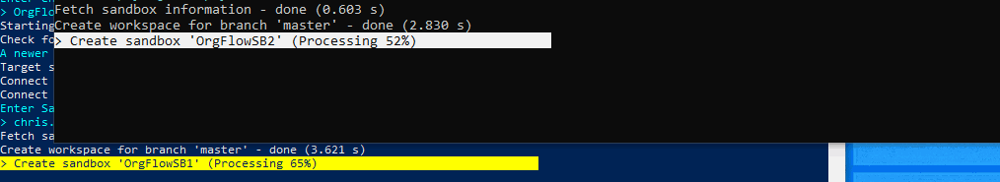
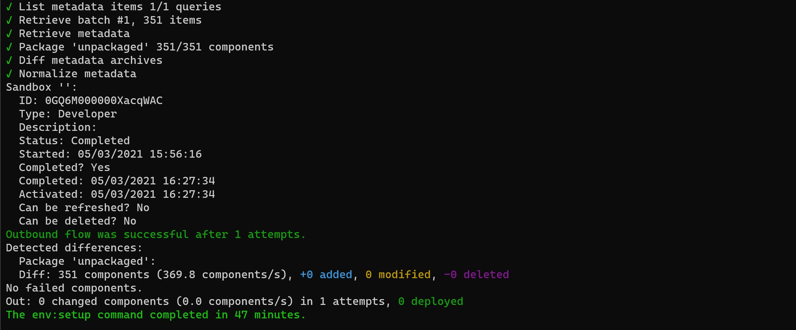
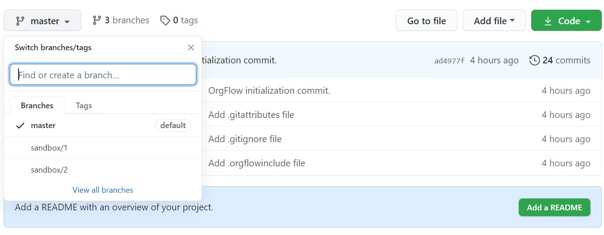

By now, you have:

- installed OrgFlow
- initialized a @concept_stack
- looked at your @concept_remotegitrepository
- set your Salesforce credentials so that they can be re-used

So far, we've only dealt with a single @concept_environment - your @concept_productionenvironment. If you want to get the most out of OrgFlow, then you'll need to add further environments to your stack. This will enable you to flow metadata changes between environments, and therefore between Salesforce organizations.

## The env:create command

We'll be using the @command_env_create command to add a new environment to the stack:

- Open your terminal (if it's not already open)
- Type `orgflow env:create` and press `ENTER`
- Follow the prompts to provide the following information:
  - Name of environment: `Env1`
  - Name of Git branch: `sandbox/1`
  - Name of sandbox: `OrgFlowSB1`

```termynal
$ orgflow env:create

?Name of environment:
=Env1
?Name of Git branch:
=sandbox/1
?Name of sandbox:
=OrgFlowSB1

Creating Git branch 'sandbox/1'
%
Creating sandbox 'OrgFlowSB1'
%
Syncing sandbox with branch
%

```

<!--  -->

Now, this command may take a short while to run. So let's go over what OrgFlow is actually doing here.

In short, OrgFlow is creating the three items needed for an environment:

1. The environment record in the @concept_statestore
2. The @concept_backinggitbranch that will contain the metadata for this particular environment
3. The Salesforce sandbox

It's that third step that is slow (it takes however long it takes Salesforce to create a sandbox).

Once the sandbox is created, OrgFlow will @concept_flowout the metadata from the backing Git branch and into the sandbox. By default, the metadata in your backing Git branch will be in the same state as it is in your production environment. This puts your sandbox into the same state as your production Salesforce organization (at least for the metadata types that we have chosen to include in our OrgFlow repository).

## Multitasking

You can run many instances of OrgFlow in parallel, which is useful if you've got a few things to do and don't have time to wait for one OrgFlow task to finish before you start another.

Keep the first terminal window open (the one that is running the `env:create` command from before), and open a second terminal window. We're going to set up a second environment at the same time as the first:

- Type `orgflow env:create` and press `ENTER`
- Follow the prompts to provide the following information:
  - Name of environment: `Env2`
  - Name of git branch: `sandbox/2`
  - Name of sandbox: `OrgFlowSB2`

```termynal
$ orgflow env:create

?Name of environment:
=Env2
?Name of Git branch:
=sandbox/2
?Name of sandbox:
=OrgFlowSB2

Creating Git branch 'sandbox/2'
%
Creating sandbox 'OrgFlowSB2'
%
Syncing sandbox with branch
%

```

<!--  -->

Wait for both commands to finish, and that's it! You now have an OrgFlow stack with one production environment and two further sandbox based environments.

<!--  -->

## Re-visiting the remote Git repository

Now that we've set up two new environments, let's have a look at what that means for the remote Git repository.

You'll notice that there are now two new branches:



Those branches were created by the @command_env_create commands that we executed. They were created (branched) from the head of the branch that backs the production environment, so their content should be the same as that branch.

The contents of each branch were then deployed to the corresponding newly created sandbox. However, in this case, the sandboxes already contained the same metadata as the branch so no changes were deployed (you should be able to see this reflected in the output of the command).
