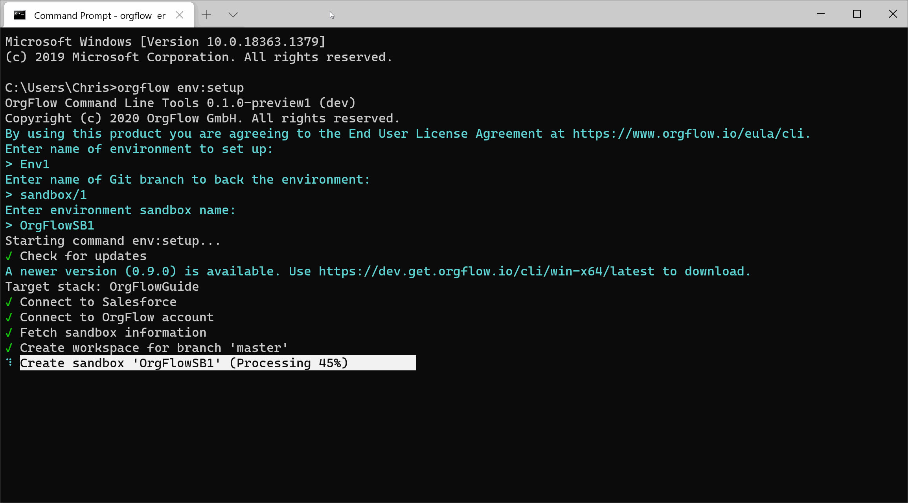

By now, you have:

- installed OrgFlow
- initialized a @concept_stack
- looked at your @concept_remotegitrepository

So far, we've only dealt with a single @concept_environment - your @concept_productionenvironment. If you want to get the most out of OrgFlow, then you'll need to add further environments to your stack. This will enable you to flow metadata changes between environments, and therefore between Salesforce organizations.

### The env:setup command

We'll be using the @command_env_setup command to add a new environment to the stack:

- Open your terminal ~(if it's not already open)
- Type `orgflow env:setup` and press `ENTER`
- Follow the prompts to provide the following information:
  - Name of environment: `Sandbox1`
  - Name of git branch: `sandbox/1`
  - Name of sandbox: `OrgFlowSB1`
  - Enter the username of your production Salesforce account when prompted

Now, this command may take a short while to run. So let's go over what OrgFlow is actually doing here.

In short, OrgFlow is creating the three items needed for an environment:

1. The environment record in the @concept_statestore
1. The @concept_backinggitbranch that will contain the metadata for this particular environment
1. The Salesforce sandbox

It's that third step that is slow (it takes however long it takes Salesforce to create a sandbox):

Once the sandbox is created, OrgFlow will @concept_flowout the metadata from the backing Git branch and into the sandbox. By default, the metadata in your backing Git branch will be in the same state as it is in your production environment. This puts your sandbox into the same state as your production Salesforce organization (at least for the metadata types that we have chosen to include in our OrgFlow repository).

You'll be prompted to provide your username again, but this time you should enter the username for the **sandbox** that you've just created (i.e. add `.OrgFlowSB1` to the end of your username). The OAuth

### Multitasking

You can run a few instances of OrgFlow in parallel, which is useful if you've got a few things to do and don't have time to wait for one OrgFlow task to finish before you start another.

Keep the first terminal window open (the one that is running the `env:setup` command from before), and open a second terminal window. We're going to set up a second environment at the same time as the first:

- Type `orgflow env:setup` and press `ENTER`
- Follow the prompts to provide the following information:
  - Name of environment: `Sandbox2`
  - Name of git branch: `sandbox/2`
  - Name of sandbox: `OrgFlowSB2`
  - Enter the username of your production Salesforce account when prompted

You'll be prompted to provide your username again, but this time you should enter the username for the **sandbox** that you've just created (i.e. add `.OrgFlowSB2` to the end of your username).

Wait for both commands to finish, and that's it! You now have an OrgFlow stack with one production environment and two further sandbox based environments.

