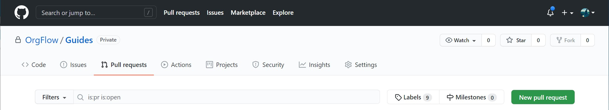
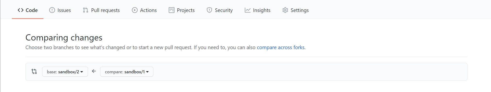
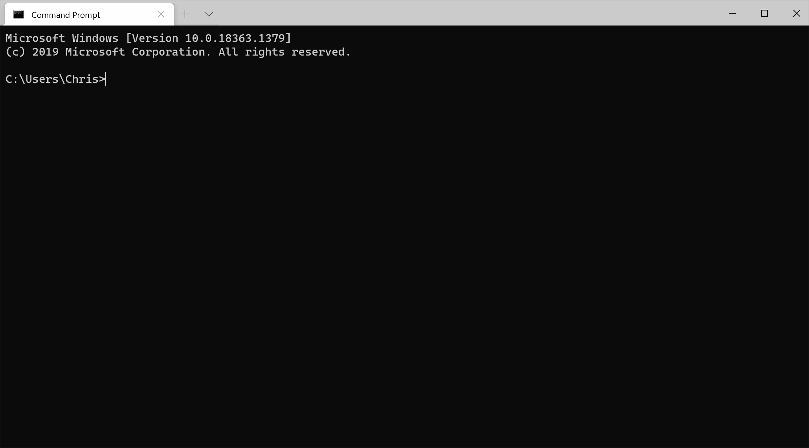
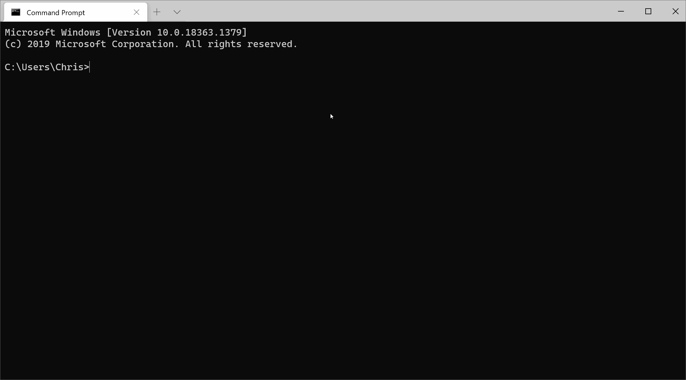

Now that we've moved metadata changes between a sandbox and the @concept_remotegitrepository, we can move on to moving those same changes between [Environments](xref:concept_environment).

There are a number of ways to do this, and we'll cover two of those methods in this chapter.

## Using Git to move metadata changes

We know that we can use the @command_env_flowout to move metadata changes from a @concept_backinggitbranch and into a Salesforce organization, so one way to move metadata between environments would be to merge changes from one backing Git branch and into another. Then, we can use the @command_env_flowout command to deploy those changes from the remote Git repository and into the Salesforce organization.

Before we begin, we need to make sure that the metadata in each backing Git branch matches the metadata that is in each Salesforce sandbox. If you've followed the previous steps of this guide, then you know that this is already the case. However, if you're unsure whether this is the case or not, you can run @command_env_flowin on both environments to make sure.

Anyone that's familiar with Git will know that there's a few ways to do this. But because we're using GitHub for our remote Git repository, we're going to simply create a pull request, and then merge the changes via the pull request. However, if you're confident enough with Git and want to do this another way, feel free to do so.

>[!TIP]
> Pull requests provide a good opportunity for changes to be peer-reviewed before they are merged into another environment.

In GitHub, click the 'Pull Requests' tab underneath the name of your repository, and then click the 'New pull request' button.



We want to merge the changes from `Env1` into `Env2`, so make sure that you pick the correct branches for those environments.



> [!TIP]
> The @command_env_list command can show you which branches back which environments.

Once the pull request has been created, you can view the differences between the metadata in the two environments. And then, if you are happy to do so, you can merge (sometimes called 'complete') the pull request. This will merge the metadata changes from the `sandbox/1` branch and into the `sandbox/2` branch.

### Moving the metadata changes from Git and into the sandbox

Now that we have the changes into the backing Git branch for `Env2`, all we need to do is flow those changes from the branch and into the sandbox. We already know we can use the @command_env_flowout command to do this:

```termynal
$ orgflow env:flowout

?Name of environment to flow out:
=Env2

Comparing
%
Deploying
%
```

<!--  -->

We can see in the results that one component was added to the sandbox- `Vehicle__c`. We've now moved this metadata change from one environment, and into another.

### Verifying that the changes have been deployed

Once the @command_env_flowout command has completed, you should be able to log in to the `OrgFlowSB2` sandbox and see the `Vehicle__c` object that you added to the `OrgFlowSB1` sandbox.

## Using the env:flowmerge command to move metadata changes

Using Git (as in the previous section) is one way of moving metadata between environments. But in order for that method to be effective, you need to first make sure that the backing Git branches is up to date with the metadata in each Salesforce organization, and then you need to manually merge the changes in Git, and then you need to run the @command_env_flowout command if you wish to deploy the result of the merge.

The @command_env_flowmerge command wraps all of these steps up for you, and so it can be a simpler option if:

- You do not necessarily know that your backing Git branches are up to date with your Salesforce organizations
- You do not need to have code changes peer reviewed (pull requests) before merging
- You want to merge environments with as little effort as possible

### Making changes to the metadata

If you've been following all the previous steps of this guide, you'll have a @concept_stack with two sandbox environments. You'll also have created an object called `Vehicle__c` in one sandbox, and then moved that object into the second sandbox. Our two sandboxes will now have parity, so we will need to make a change or two for the @command_env_flowmerge command to actually do anything.

Because we merged all the changes we made from one environment into another, we'll need to make some more changes in the sandboxes to be able to do another merge.

Log into the first sandbox and update the description of the `Vehicle__c` object. Then, log in to the second sandbox and change the `Data Type` field (e.g. from `Text` to `Auto Number` or vice versa). We're going to merge this change into the first sandbox using the @command_env_flowmerge command.

To do this:

- Open up a terminal window and run `orgflow env:flowmerge`.
- When prompted, enter `Env2` as the name of the environment that you want to merge from.
- Enter `Env1` as the name of the environment that you want to merge into.

```termynal
$ orgflow env:flowmerge

?Name of environment to merge from (source):
=Env2
?Name of environment to merge into (target):
=Env1

Flow in Env2
%
Flow in Env1
%
Merge Env2 into Env1
%
Flow out Env1
%
```

<!--  -->

This command may take a couple of minutes to complete, so let's go through what OrgFlow is doing while we wait:

- The metadata from both sandboxes is flowed in to the respective backing Git branches (in parallel)
- Once that has completed, the source backing Git branch is merged into the target backing Git branch
- The result of that merge is the flowed out to the target Salesforce organization
- The updated backing Git branch for the target environment is then pushed back up to the remote Git repository

### Verifying the merge

Wait for the command the complete and then look at the definition of the `Vehicle__c` object in `OrgFlowSB1`. You'll notice that the description from this sandbox is still in place, and that the change to the `Data Type` field from the `OrgFlowSB2` sandbox is also there.

If you had have used a changeset (or most other deployment tools) to do this, then the metadata record from the source sandbox would have simply overwritten the record in the target sandbox, resulting in the loss of the change to the `Description` field that you made.

Next up, learn how to [control which metadata type are processed by OrgFlow](xref:guide_controllingincludedmetadata).
