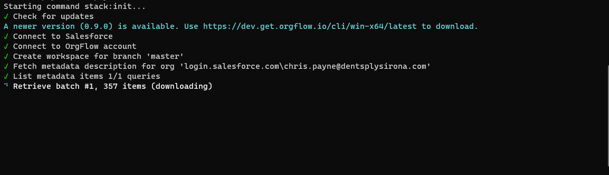

One of the benefits of OrgFlow is that it runs locally on your computer. This means that your metadata is never downloaded to (or processed on) a remote, third-party's server in the cloud.

This getting started guide will get you up and running in no time.

At the end of this guide, you'll have:

- installed OrgFlow onto your computer
- run your first command
- created your first @concept_stack and added an @concept_environment
- looked at your metadata in the @concept_remotegitrepository
- flowed metadata from your sandbox to your remote Git repository, and vice versa
- explore ways to move metadata changes between [Environments](xref:concept_environment)
- learn how to change which metadata types and records are handled by OrgFlow

OrgFlow is extremely versatile, which means that there will usually be more than one way to build out your processes and workflows. These guides will keep things simple and take you through techniques and concepts one at a time. As you work through the guides and build up your knowledge, you should begin to feel confident to design OrgFlow-based processes that are best suited to your requirements.

## Installing OrgFlow

OrgFlow is cross platform, and supports Windows, macOS, and Linux. Use the tabs to follow the instructions for the computer you are working on.

# [Windows](#tab/win)

Head to the [download page](https://www.orgflow.io/download) and download the latest installer (`.msi`) for Windows.

Run the installer, accepting all the default values (make sure that you agree to the EULA before accepting). The installer will copy the OrgFlow executable into place, as well as updating your PATH environment variable so that you can run OrgFlow from any location.

That's it! You're ready to run your first command.

# [macOS](#tab/mac)

Head to the [download page](https://www.orgflow.io/download) and download the latest installer (`.pkg`) for macOS.

Run the installer, accepting all the default values (make sure that you agree to the EULA before accepting). The installer will copy the OrgFlow executable into place, as well as creating a symbolic link so that you can run OrgFlow from any location.

That's it! You're ready to run your first command.

# [Linux](#tab/linux)

Head to the [download page](https://www.orgflow.io/download) and download the latest packaged version (`.zip`) for Linux.

Once downloaded, extract it to your preferred location on disk.

That's it! You're ready to run your first command.

***

## Running your first command

Now that you've got OrgFlow installed, let's run a command.

Open a command prompt or terminal:

# [Windows](#tab/win)

1. Press `START`
1. Type `cmd`
1. Press `ENTER` on your keyboard

# [macOS](#tab/mac)

1. Hold down the command key (`⌘`) and press the `SPACE` bar to open Spotlight
1. Type `Terminal` so search for the Terminal application
1. Double click the Terminal app icon that should be highlighted in Spotlight

# [Linux](#tab/linux)

If you're using Linux, we'll go ahead and assume that you already know how to open the terminal.

Just make sure that your current directory is the directory that you unzipped the OrgFlow executable to.

***

At the terminal prompt, type `orgflow --version` and press enter to run the command:

```termynal
$ orgflow --version
1.1.2

OrgFlow (prod/RELEASE)
Copyright Ⓒ OrgFlow GmbH
```

<!--  -->

That's it- you've just executed your first OrgFlow command.

The command you executed was the 'version' command ([`orgflow --version`](xref:command_version)). It displays the version of OrgFlow that you have installed.

Another useful command is [`orgflow --help`](xref:command_help), which displays a list of things you can do with OrgFlow, and how to do them. You can run this command at any time if you get stuck, or need a reminder on how to do something.

## Creating a stack

> [!NOTE]
> Before you continue, you should make sure that you have all the prerequisites:
>
> - You'll need access to a production Salesforce organization.
> - You can complete this part of the guide without having to create any sandboxes, but you'll need to be able to create them to complete the later stages of the guide.
> - You'll need to have Git installed. [Here's a guide](https://github.com/git-guides/install-git) if you need it.
> - You'll also need access to a Git repository that you can use to store metadata. We recommend creating a new repository for the purposes of these guides. You can use any Git service that you're familiar with, but we'll be using [GitHub](https://github.com/) in these guides.
> - Your Git installation should be configured so that it can authorize with the remote Git repository that you plan to use for these guides. The easiest way to check this is simply to use Git to clone the repository. If it works, you already have this set up. Otherwise, Git will prompt for credentials, which can then be re-used by OrgFlow over the course of this guide.

Your @concept_stack is the backbone of everything you do with OrgFlow, so the next thing we'll need to do is to create your first stack.

### The stack:create command

Open up your terminal again, and this time type `orgflow` and press `ENTER`. This will start OrgFlow in interactive mode, and you'll be prompted with a list of command. Use the arrow keys to select the command you'd like to run (in this case, `stack:create`), and press `ENTER`:

<!--  -->

This will start the @command_stack_create command in interactive mode. You'll be prompted for a few bits of information:

- The name of the stack to create. Be as creative as you want here, but just make sure that you don't already have an existing stack with the same name. We'll use `OrgFlowGuide` in these guides.
- The URL of your remote Git repository. This value will be unique to you; for the purposes of these guides, I created an empty repository (`https://github.com/OrgFlow/Guides.git`) in our GitHub organization: 

  >[!CAUTION]
  > Your Salesforce metadata will be committed to this repository, so be careful not to accidentally use a public repository if you are not comfortable making your Salesforce metadata visible to the public.

- The type of metadata that you want to include in your stack. We'll cover this in more detail later on, but for now pick `CustomObjectsOnly`.
- The name of your @concept_productionenvironment. Leave the default value in place (`Production`).
- The name of the @concept_backinggitbranch for your production environment. Again, just leave the default value in place.
- Your Salesforce username for the production organization. Enter your Salesforce username here. Don't worry- OrgFlow does not store this username anywhere.

Once you've entered all of this information, OrgFlow will begin the process of creating the stack.

```termynal
$ orgflow

?Which command do you want to execute?
=stack:create
?Enter name of stack to create:
=OrgFlowGuide
?Enter URL of remote Git repository:
=https://yourrepo.com/repo.git
?Which kinds of metadata:
=CustomObjectsOnly
?Enter name for production environment:
=Production
?Enter name of Git branch:
=main
?Salesforce production org username:
=salesforceusername@yourcompany.com

Logging into Salesforce
%
Downloading metadata
%
Committing metadata to repository
%
```

### Authentication

OrgFlow will use OAuth to authenticate with Salesforce.

Whenever authentication is required, OrgFlow will open a browser window that will prompt you to log in to Salesforce. This ensures that OrgFlow never knows your password, and it also allows advanced authorization techniques (such as MFA) to be utilized by Salesforce.

When the browser window opens, enter the password for your Salesforce user, and then complete any further challenges that Salesforce might ask for. Once Salesforce has verified your identity, it will give a token back to OrgFlow. This token can be remembered and re-used by OrgFlow for as long as it if valid for. This reduces the amount of times that Salesforce requires you to enter your password.


### Monitoring progress

OrgFlow will always keep you updated on its progress:



The `stack:create` command is one of the slower commands, and it may take a few minutes to complete (especially if you have a lot of metadata in your organization). Operations that rely on Salesforce (such as downloading or uploading metadata) can occasionally be slowed down by Salesforce, but other than that, OrgFlow is careful to be as efficient as possible.

### Finishing touches

Once OrgFlow has created your stack, it will then prompt to help you put some finishing touches to it. Your stack is fully usable at this point, but these extra options might make it easier to use going forward.

The first thing that you'll be asked is if you want to save your Salesforce credentials for re-use in any further commands that you run. If you pick yes, then OrgFlow will ask a series of questions to determine how and where to save your credentials.

You'll also be provided with an encryption key to allow you to retrieve the password that you saved. That encryption key will be cached on your device so that OrgFlow can re-use it automatically, but you should still keep a record of it as you won't be able to retrieve the encryption key once you close this window.

For the purposes of this guide, we recommend that you pick the following options:

- Save your credentials
- Allow OrgFlow to transform the credentials for any environment (see @concept_credentialinference for how this works)
- Store the credentials on your local device
- Provide your production username
- Provide your password

>[!NOTE]
> Your Salesforce org may be [configured in a way that requires a Security Token to be supplied with your password](https://developer.salesforce.com/docs/atlas.en-us.api.meta/api/sforce_api_concepts_security.htm). In this case, you must append your security token to the end of the password that you save. For example, if your password is `OrgFlow123`, and your token is `abcdefg`, then you should use `OrgFlow123abcdefg`.

```termynal
?Would you like to save Salesforce credentials?
=Yes
?For which environments?
=Transform for any environment
?Where should the credentials be stored?
=Only on this device
?Username:
=salesforceusername@yourcompany.com
?Password (leave empty to use interactive browser sign-in):
=**********************

Saving
%

Encryption key: 84104e59acd186......................3a7b6ba
```

>[!TIP]
> If you would prefer to continue to use Salesforce's OAuth login mechanism, then you can do so by saving your username, but leaving the password prompt empty.

Once you've done this, let's [take a look at the results](xref:guide_inspectingtheremotegitrepository).
