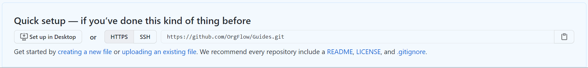

> [!NOTE]
> Before you begin, you should make sure that you have all the prerequisites:
>
> - You'll need access to a production Salesforce organization.
> - You can complete this part of the guide without having to create any sandboxes, but you'll need to be able to create them to complete the later stages of the guide.
> - You'll need to have Git installed. [Here's a guide](https://github.com/git-guides/install-git) if you need it.
> - You'll also need access to a Git repository that you can use to store metadata. We recommend creating a new repository for the purposes of these guides. You can use any Git service that you're familiar with, but we'll be using [GitHub](https://github.com/) in these guides.
> - Your Git installation should be configured so that it can authorize with the remote Git repository that you plan to use for these guides. The easiest way to check this is simply to use Git to clone the repository. If it works, you already have this set up. Otherwise, Git will prompt for credentials, which can then be re-used by OrgFlow over the course of this guide.

Your @concept_stack is the backbone of everything you do with OrgFlow, so the next thing we'll need to do is to initialize your first stack.

Open up your terminal again, and this time type `orgflow` and press `ENTER`. This will start OrgFlow in interactive mode, and you'll be prompted with a list of command. Use the arrow keys to select the command you'd like to run (in this case, `stack:init`), and press `ENTER`:

This will start the @command_stack_init command in interactive mode. You'll be prompted for a few bits of information:

- The name of the stack to initialize. Be as creative as you want here, but just make sure that you don;t already have an existing stack with the same name. We'll use `OrgFlowGuide` in these guides.
- The URL of your remote Git repository. This value will be unique to you, for the purposes of these guides, I created an empty repository (`https://github.com/OrgFlow/Guides.git`) in our GitHub organization: 
- The type of metadata that you want to include in your stack. We'll cover this in more detail later on, but for now pick `CustomObjectsOnly`.
- A path to store your metadata files relative to the root of your remote Git repository. Leave this empty.
- The name of your @concept_productionenvironment. Leave the default value in place (`Production`).
- The name of the @concept_backinggitbranch for your production environment. Again, just leave the default value in place.
- Your Salesforce username for the production organization. Enter your Salesforce username here. Don't worry- OrgFlow does not store this username anywhere.

Once you've entered all of this information, OrgFlow will begin the process of initializing the stack.

### Authentication

OrgFlow will use OAuth to authenticate with Salesforce.

Whenever authentication is required, OrgFlow will open a browser window that will prompt you to log in to Salesforce. This ensures that OrgFlow never knows your password, and it also allows advanced authorization techniques (such as MFA) to be utilized by Salesforce.

When the browser window opens, enter the password for your Salesforce user, and then complete any further challenges that Salesforce might ask for. Once Salesforce has verified your identity, it will give a token back to OrgFlow. This token can be remembered and re-used by OrgFlow for as long as it if valid for. This reduces the amount of times that Salesforce requires you to enter your password.

### Monitoring progress

OrgFlow will always keep you updated on its progress:

The `stack:init` command is one of the slower commands, and it may take a few minutes to complete (especially if you have a lot of metadata in your organization). Operations that rely on Salesforce (such as downloading or uploading metadata) can occasionally be throttled by Salesforce, but other than that, OrgFlow is careful to be as efficient as possible.

Wait until the command has finished (you'll see a green message in the output to indicate that it's complete), and then you can move on to the next step.
