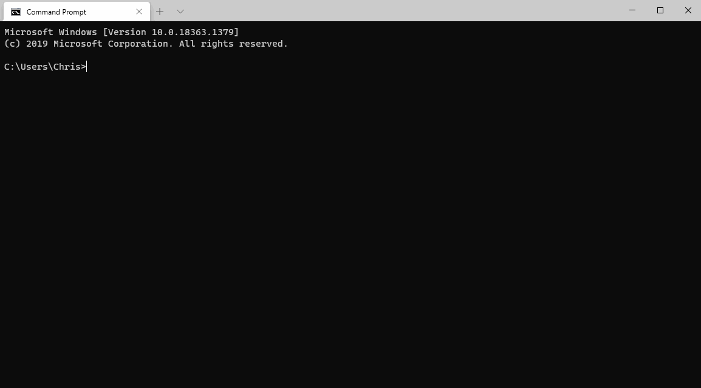

By now, you'll have installed OrgFlow and initialized your first @concept_stack. You can verify this by running `orgflow stack:list`:

The @command_stack_list command displays all the stacks that you own; you can see the stack that we've just initialized in that list.

But what exactly has the `stack:init` command done?

- created the stack record in the @concept_statestore
- created your @concept_productionenvironment
- [flowed in](xref:concept_flowin) the metadata from your production Salesforce organization and into your @concept_backinggitbranch

This would be a good time to have a look at the remote Git repository. Remember- we're using GitHub, but you can use any Git service that you like.

There's some files and folders in there that weren't there before.

Open up the `unpackaged` folder. This folder contains all your the unpackaged metadata that you flowed in during `stack:init`. Remember that we picked `CustomObjectsOnly` when choosing which metadata types to include? You should be able to see all (and only) your objects in the Git repository. If you open up one of the object files, you will be able to see the contents of it- an XML file that contains nodes that describe your object.

> [!TIP]
> If you can't see anything, make sure that you've got the correct branch selected. The metadata will have been committed to whatever branch name you gave during `stack:init`.

### Author attribution

If you look at the commits in the repository, you may notice that each commit is authored by a user within your Salesforce organization. This is OrgFlow's author attribution in action.

For very file committed, OrgFlow uses Salesforce's change history to determine who last changed the metadata item that the file represents. If you frequently run the @command_flow_in command, you'll quickly build up a comprehensive history of changes, and you'll be able to attribute each change to a particular user in Salesforce.

