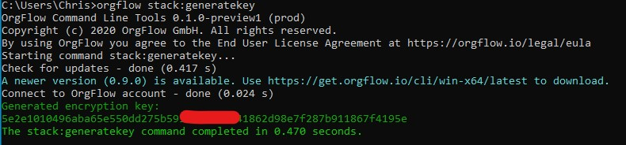
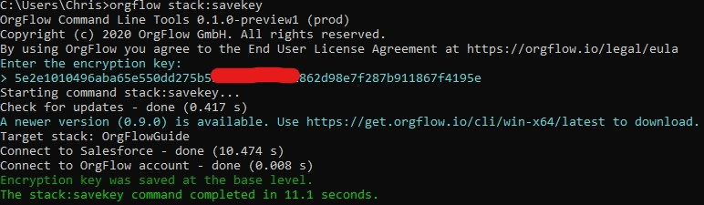
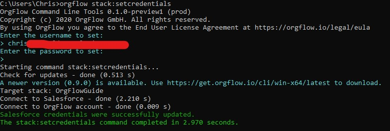

In the previous chapter, we added two new [environments](xref:concept_environment) to our @concept_stack. During this process, we were prompted for our Salesforce credentials more than once. This can be cumbersome if you are frequently running using OrgFlow.

Thankfully, it's possible to store your Salesforce credentials safely with OrgFlow so that they can be re-used without you having to input them during every command.

> [!TIP]
> If you'd like to get a better understanding of how credentials are stored and retrieved by OrgFlow, we recommend reading the @concept_credentialinferrence and @concept_encryptionkey docs, as well as the docs on the individual commands used in this guide.

### Obtaining an encryption key

An encryption key is simply a 64 character combination of numbers or letters from A to F. It's a secret value that is designed to prevent people who you do not trust (i.e. those that you have not shared the encryption key with) from reading your Salesforce credentials.

OrgFlow has a command to create an encryption key for you: [stack:generatekey](xref:command_stack_generatekey). There is also a command to save this key so that you don't need to keep supplying it every time you run a command: [stack:savekey](xref:command_stack_savekey).

- Open up a terminal window (if you need to)
- Type `orgflow stack:generatekey` and press `ENTER`
- Copy the key from the output (it'll look something like this:)
  
  

- Type `orgflow stack:savekey` and press `ENTER`
- When prompted, paste the encryption key and press `ENTER`

  

You've now generated an encryption key, and saved it locally for re-use by OrgFlow.

### Setting credentials

Now that we've got our encryption key and saved it so that is can be re-used without having to specify it each time, we can move on to saving credentials for re-use.

The command to do this is the @command_stack_setcredentials command:

- Open up a terminal window (if you need to)
- Type `orgflow stack:setcredentials` and press `ENTER`
- Enter the username for your production Salesforce account and press `ENTER`
- Leave the value for password empty and press `ENTER`

We've now saved your Salesforce username for re-use in further guides. We left the password empty because we still want to continue to use the OAuth authentication flow for now.
