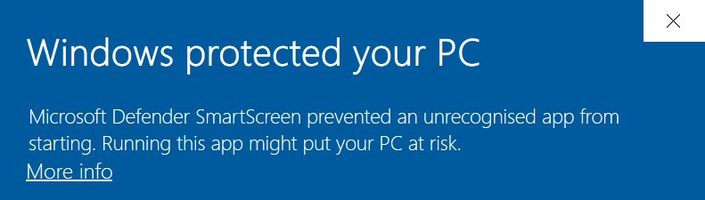

OrgFlow is a cross-platform command line interface (CLI) tool. All of your Salesforce metadata is processed locally on the device that you are running OrgFlow on. This has several advantages, including:

- Peace of mind that your metadata is being processed on infrastructure that you trust
- Control over performance and scale
- Deep integration with popular CI/CD tools

However, this also means that you need to download and install OrgFlow on every device on which you plan to use it. This article will take you through the different installation packages that are available, and guide you through downloading and installing the correct one for your needs.

## Choosing the best package for your needs

We offer OrgFlow for a number of platforms, and in a number of different package types. The best one for you will depend on your target platform (Windows, macOS, Linux), and your use case (permanent installation e.g. on your personal device, or temporary installation e.g. on an ephemeral device such as a build agent).

The different platforms and the package types that we support for each of them are:

|                   | Windows     | macOS                  | Linux |
| ----------------- | ----------- | ---------------------- | ----- |
| Installer Package | ✔️ x64 & x86 | ✔️ x64 (Intel & Apple*) | ❌     |
| ZIP Archive       | ✔️ x64 & x86 | ✔️ x64 (Intel & Apple*) | ✔️ x64 |
| Docker Image      | ✔️ (via WSL) | ✔️                      | ✔️     |

*via Rosetta. Native Apple silicon support coming soon.

### Installer Packages

Installer packages are point and click installers that you can use to manually install OrgFlow on a device. They're offered as `.msi` for Windows, and `.pkg` for macOS. We don't currently offer an installer package for Linux.

As well as installing the OrgFlow binaries, the installer packages can also (optionally) add the installation path to your PATH, so that the OrgFlow executable can be called from any location within your terminal.

### ZIP Archives

ZIP archives contain all the binaries required to run OrgFlow, without the overhead of an installer. You extract contents of the ZIP to a location on disk, and then run OrgFlow from that location.

This is useful for cases where you may want to script or automate installation, or simply for cases where you do not want to (or cannot) use an installer package.

### Docker Image

Our official [orgflow/cli](https://hub.docker.com/r/orgflow/cli) Docker images are ideal for automation scenarios. Most CI/CD tool support running workflows or processes within a container, and we would recommend taking this approach with automation when you can.

Of course, you could also use the Docker image locally on your own device, but this would come with an overhead of waiting for the container to be spun up, as well as additional configuration steps that you may have to perform.

## Pre-requisites

OrgFlow requires Git version `2.25` or above. It's possible that you already have Git installed on your device, and you can verify this (and the version that you have installed) by running `git --version`.

There are various ways that you can install (or update) Git, including by downloading the latest version from [https://git-scm.com/downloads](https://git-scm.com/downloads).

> [!TIP]
> The [orgflow/cli](https://hub.docker.com/r/orgflow/cli) Docker image includes Git, so you do not need to worry about installing it.

## Downloading OrgFlow

OrgFlow can be downloaded from [https://www.orgflow.io/download](https://www.orgflow.io/download).

You'll find version information and release notes on this page, as well as instructions and links to download the latest version of OrgFlow for all the different platforms and package types that we support.

### Versioning

We aim to use [semantic versioning](https://semver.org/) when versioning the OrgFlow CLI. This means that you can be confident in the scope of changes when updating the CLI.

Any breaking changes that we introduce will always be signified by a **major** version increment. New functionality without breaking changes will be a **minor** increment. And bug fixes will be a **patch** increment.

## Installing OrgFlow

### With an Installer Package

The installer packages are point and click tools that will guide you through installing OrgFlow for Windows (`.msi`) or macOS (`.pkg`).

#### Windows

Once downloaded, double click to run the installer package.

> [!NOTE]
> We are working on getting our installers signed, but until we do, you may get interrupted by a dialog with the message **Windows protected your PC**?
>
> 
>
> If you encounter this dialog, you need to click the `More info` link (as seen in the image above), and then click the `Run anyway` button that will appear at the bottom of the dialog.

Follow the process through until it has completed. The installer packages can optionally add the installation directory to your PATH. We recommend that you do this so that you can run OrgFlow from any location on disk.

#### macOS

Once downloaded, **right click** the `.pkg` file, and select `Open` from the context enu that appears. Then, click the `Open` button in the dialog box that appears.

> [!NOTE]
> We are working on getting our installers signed, but until we do, you may not be able to run the `.pkg` installer package simply by double clicking it.
> Right clicking the installer package indicates to macOS that you trust the `.pkg` file.

Follow the process through until it has completed. The installer packages can optionally add the installation directory to your PATH. We recommend that you do this so that you can run OrgFlow from any location on disk.

### With a ZIP Archive

The ZIP archive that you download contains all of the binaries and files that make up the OrgFlow CLI tool.

You'll need to extract the ZIP archive to a location on disk that you choose. You can then run OrgFlow from that location. For convenience, we recommend adding the extraction location to your PATH, which will allow you to run ORgFlow from any location on disk.

### Running the Docker image

The official OrgFlow CLI Docker image is called [`orgflow/cli`](https://hub.docker.com/r/orgflow/cli). We won't cover installing Docker in this document, but to quickly get up and running with the latest version of OrgFlow in Docker, you simply need to run:

```bash
docker run --rm -it orgflow/cli:latest bash
```

The @tutorial_usingdockerimages tutorial has more information about best patterns and practices when using the OrgFlow Docker images.
