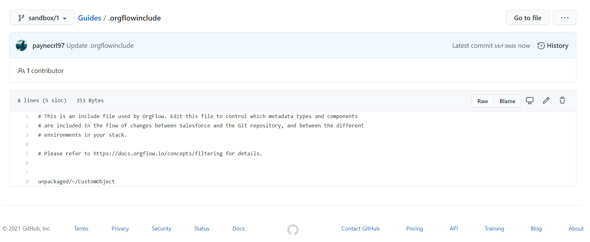

So far, we've only been flowing custom objects and their nested types (fields, etc.). If you remember right back to the @guide_initializingastack guide, we were asked by the @command_stack_create command which categories of metadata we wanted to include. The selection we made here was used to create a @concept_orgflowincludefile, which in turn was committed to the root of the @concept_remotegitrepository. This file holds the key to which metadata types we include and exclude when flowing changes using our @concept_stackbasedcommands.

## The .orgflowinclude file

The .orgflowinclude file was created for us by the @command_stack_create command, but we are free to edit it to create our own include and exclude rules.

> [!TIP]
> This tutorial will guide you through a few small changes to this file, but the include and exclude rules are very flexible and very powerful. We recommend reading the @concept_orgflowincludefile and @concept_includespecs concept pages to get a better understanding of the syntax used to include and exclude metadata types.

### Editing the .orgflowinclude file

- Open your remote Git repository up in GitHub (or wherever you may have chosen to put it).
- There will be a file called `.orgflowinclude` in the root of the repository- click it to open it, and switch the branch to `sandbox/1`.
  
- Find the line that says `unpackaged/~/CustomObject` (this means include all `CustomObject` types without a namespace prefix (`~`) that are `unpackaged`).
- We're going to begin including the `ApexClass` types without namespace prefixes that are `unpackaged`, so add the following line: `unpackaged/~/CustomObject`.
- We're also going to exclude the `CustomObject` type called `Account`:
  - Include specs can be built up line by line to declare complex include and exclude rules.
  - In this case we are already including all custom objects, and we want to selective exclude a single, specific custom object.
  - An include spec can be negated (turned into an exclude rule) by prepending it with the `!` character.
  - The include spec for the `Account` `CustomObject` would be `unpackaged/~/CustomObject/Account`, so the exclude spec would be `!unpackaged/~/CustomObject/Account`.
  - The order of the include specs within the .orgflowinclude file is important. Lines that appear further up the file have less precedence than lines that appear further down it.
  - So, the required syntax here is:
    ``` orgflowinclude
    unpackaged/~/CustomObject
    !unpackaged/~/CustomObject/Account
	```
  - The first line declares that all `unpackaged` `CustomObject`s without a namespace prefix (`~`) should be included. The second line caveats that with '**except** for the one called `Account`'.

Your include specs should now look something like this:

``` orgflowinclude
unpackaged/~/CustomObject
!unpackaged/~/CustomObject/Account

unpackaged/~/ApexClass
```

Commit the changes you have made to this file.

### Applying the new include specs

Even though we have updated the .orgflowinclude, you may notice that the metadata in the repository does not yet reflect these changes. This is because OrgFlow is not yet aware that the file has changed, and so the changes have not been applied.

Of course, @command_env_flowin is the command we need to use here, because that is the command that updates the metadata in the backing Git branch. Open up terminal and run `orgflow env:flowin`, enter `Env1` as the environment name, and leave the commit message empty.

Once the command has completed, take a look at the metadata in the remote Git repository. You'll notice that there's now a folder containing Apex classes, and that the Account object has been deleted.

> [!TIP]
> The include specs affect both the inbound and outbound flow processes. The `Account` object has been deleted from the remote Git repository because it is no longer included in the metadata that OrgFlow flows in. This means that the `Account` object is also excluded from the flow out process, which means that its removal from the remote Git repository will not cause OrgFlow to attempt to delete the object from the Salesforce organization when flowing out.
