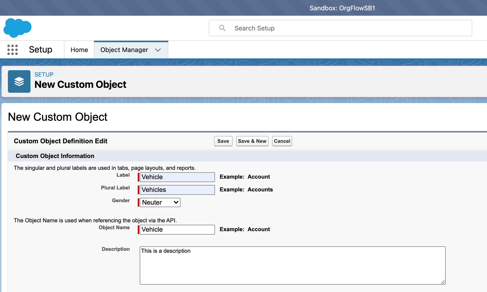
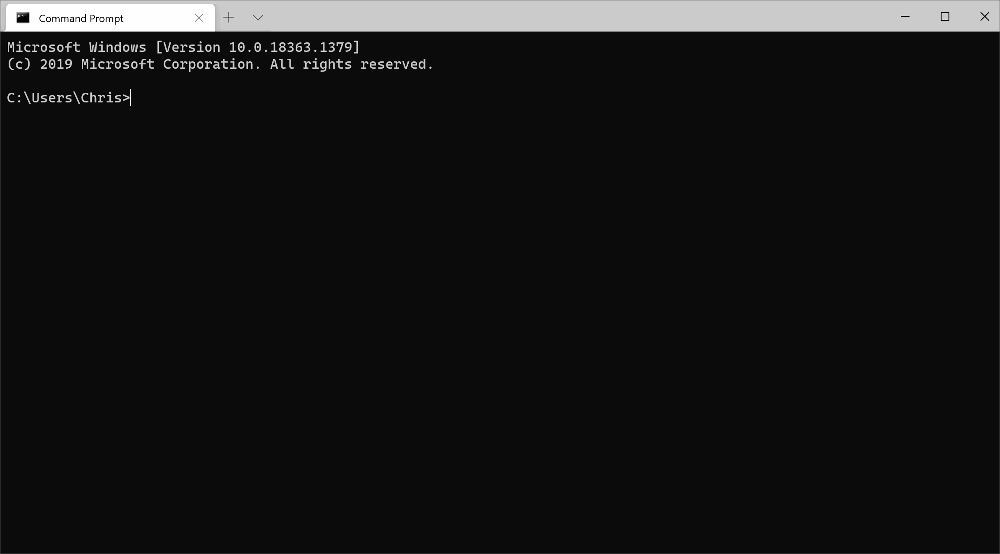

In the @guide_gettingstarted guide, we installed OrgFlow, and created a @concept_stack with a couple of sandbox environments in it. We'll be using that stack as a starting point in this guide.

> [!TIP]
> We won't be making any changes to your @concept_productionenvironment during this guide, so don't worry about accidentally breaking anything.
>
> However, OrgFlow **does** allow you to make metadata changes directly to your production Salesforce org if you wish to. In fact, all of the techniques we're going to go through in this guide would work just as well in your production org as they do in a sandbox.

'@concept_flowin' refers to the action of moving metadata changes from your Salesforce org and into the @concept_backinggitbranch.

## Add a new object to your sandbox

To start, we need to make a change to the metadata in order to have something to flow in. The @concept_stack that we created during the @guide_gettingstarted guide only included custom objects and their nested types (such as fields and actions etc.). We need to make sure that whatever object we change is included in the metadata that OrgFlow will process.

Log in to the `OrgFlowSB1` sandbox that you created, and add an object called `Vehicle` with some description:



## Execute the command

Open up a terminal window and run the following command: `orgflow env:flowin`. You'll be prompted for:

- The name of the environment to flow in. You made changes in the `OrgFlowSB1` sandbox, and that sandbox is linked to the environment called `Env1`. Enter `Env1` at this prompt.
- A commit message. Enter whatever you like here (or leave it empty and OrgFlow will use a default value for the commit message).

```termynal
$ orgflow env:flowin

?Name of environment to flow in:
=Env1
?Commit message:
=Adds vehicle object

Committing changes
%
```

<!--  -->

## Check the results

We've successfully executed our first @command_env_flowin command, but what has actually happened?

- OrgFlow checked for any changes to the metadata in the sandbox (only for those object types that we include).
- It noticed that a new object had been added, as well as the person who had added it.
- It then committed that new object to the @concept_backinggitbranch, and pushed that branch back up to the @concept_remotegitrepository.

We can confirm that by looking at the remote Git repository. There should be a new file called `Vehicle__c.object` in the `unpackaged/objects` folder. Make sure that you have the correct branch selected (`sandbox/1`), as this new file will only exist in this branch for now.

Next up, we'll [flow changes in the opposite direction](xref:guide_flowingchangesout).
