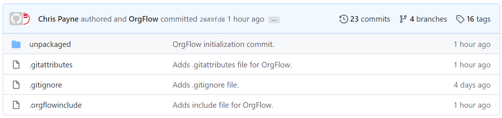

This guide will get you up and running with the OrgFlow Command Line Interface (CLI). It's designed to be light on details, so that you can get started with some of the basic concepts of OrgFlow as quickly as possible. We also have guides and command reference pages available, if you want to go deeper into OrgFlow.

#### Before you start
You'll need a few things in place before you can start using OrgFlow. See the [Pre-requisites](guides_quickstartprerequisites) page to make sure you have everything you'll need.

This guide will assume that you're using Windows, but OrgFlow is also available for macOS and Linux. You should still be able to follow this guide if you're not using Windows.

### Running OrgFlow for the first time
Open the folder that you saved the OrgFlow CLI to, and double click the **OrgFlow.exe** file. This will open up OrgFlow, and you'll be asked which command you want to run. Use the arrow keys to select `stack:init` (near the bottom of the list), and then press enter to run that command. The `stack:init` command initializes your stack, and is the very first thing we'll need to do.

You'll be asked a few questions, mainly about your Git repository and your Salesforce instance (see [pre-requisites](guides_quickstartprerequisites) if you don't have these values). OrgFlow needs these details to be able to link the two together.

When you're asked what kind of metadata you want to flow, pick **Objects only** for the purposes of this guide.

Once you've answered all the prompts, OrgFlow will begin initializing your Stack. This process might take a few minutes, depending on how large your Salesforce org is.

### Verifying your metadata
During initialization, OrgFlow will take the metadata from your Salesforce org, and commit it to your Git repository. Now that initialization is complete, we should be able to see the metadata in the Git repository.

This guide assumes that you're using GitHub, but OrgFlow works with any Git provider. You should still be able to follow this part of the guide if you're not using GitHub.

Go to your repository's home page in a web browser. It might look something like this:

